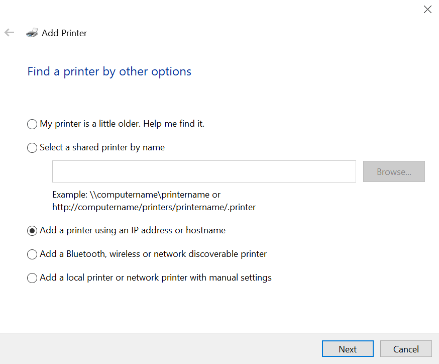
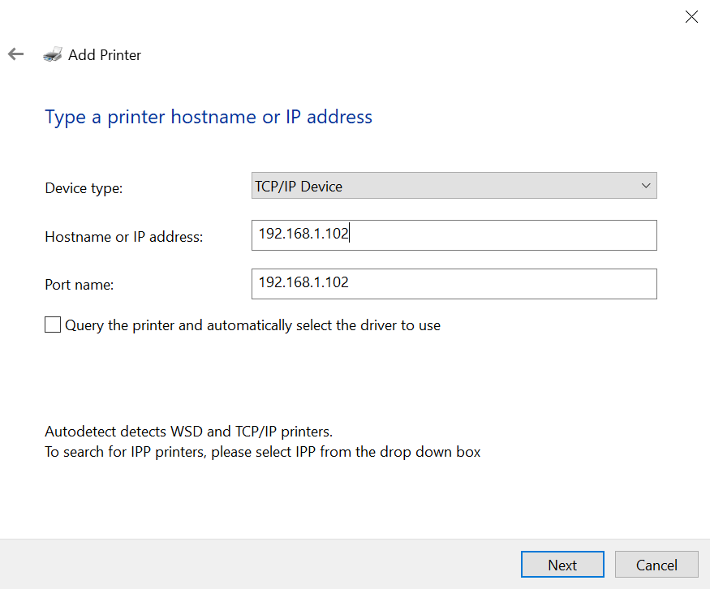
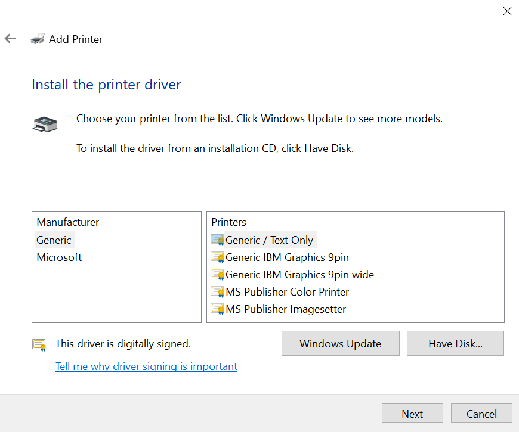
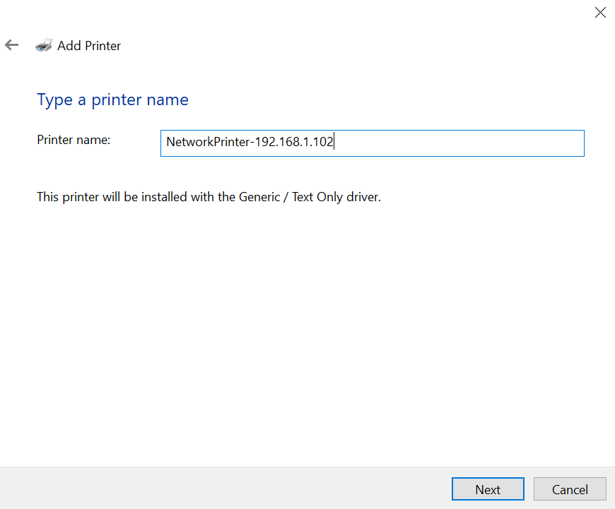

# How to Add a Network Printer in Windows 10
## Help Desk Reference Guide

This guide walks through adding a network printer manually using an IP address — useful when Windows doesn't auto-detect the printer.

---

## Prerequisites

- The printer must be powered on and connected to the network
- You need the printer's IP address (e.g. `192.168.1.102`)
- You must be logged in as a user with admin rights

---

## Step 1 — Open the Add Printer Wizard

1. Press **Windows + R**, type `control printers`, and press Enter
2. Click **Add a printer**
3. If Windows doesn't find it automatically, click **"The printer that I want isn't listed"**

---

📷 *Screenshot 1*
> 

## Step 2 — Choose "Add a printer using an IP address or hostname"

On the **"Find a printer by other options"** screen:

- Select **"Add a printer using an IP address or hostname"**
- Click **Next**

> Other options on this screen:
> - *My printer is a little older* — for legacy printers
> - *Select a shared printer by name* — for shared network printers (e.g. `\\computername\printername`)
> - *Add a Bluetooth, wireless or network discoverable printer* — auto-discovery

---

📷 *Screenshot 2*
> 

## Step 3 — Enter the IP Address

On the **"Type a printer hostname or IP address"** screen:

| Field | Value |
|---|---|
| Device type | TCP/IP Device |
| Hostname or IP address | `192.168.1.102` |
| Port name | `192.168.1.102` (auto-filled) |

- Leave **"Query the printer and automatically select the driver"** unchecked if you want to choose the driver manually
- Click **Next**

> **Note:** For IPP printers, change the Device type dropdown to **IPP** instead of TCP/IP.

---

📷 *Screenshot 3*
> 

## Step 4 — Install the Printer Driver

On the **"Install the printer driver"** screen:

1. Select a **Manufacturer** from the left list
2. Select the matching **Printer model** from the right list
3. If your printer isn't listed, click **Windows Update** to download more drivers
4. If you have a driver CD or downloaded `.inf` file, click **Have Disk...**

> In this example, **Generic / Text Only** was selected under the **Generic** manufacturer. This is a safe fallback driver if the exact model isn't available.

- Click **Next**

---

📷 *Screenshot 4*
> 

## Step 5 — Name the Printer

On the **"Type a printer name"** screen:

- Enter a descriptive name, e.g. `NetworkPrinter-192.168.1.102`
- The screen confirms which driver will be used
- Click **Next**

---

## Step 6 — Finish

- Choose whether to share the printer on the network (optional)
- Click **Finish**

The printer will now appear in your **Devices and Printers** list.

---

## Troubleshooting

| Issue | What to check |
|---|---|
| Printer not found at IP | Ping the IP (`ping 192.168.1.102`) to confirm it's reachable |
| Wrong driver | Download the correct driver from the manufacturer's website |
| Print job stuck | Restart the **Print Spooler** service (`services.msc`) |
| IP changes over time | Assign a static IP to the printer from the router's DHCP settings |

---

*Guide based on Windows 10 Add Printer Wizard — steps may vary slightly on Windows 11.*
